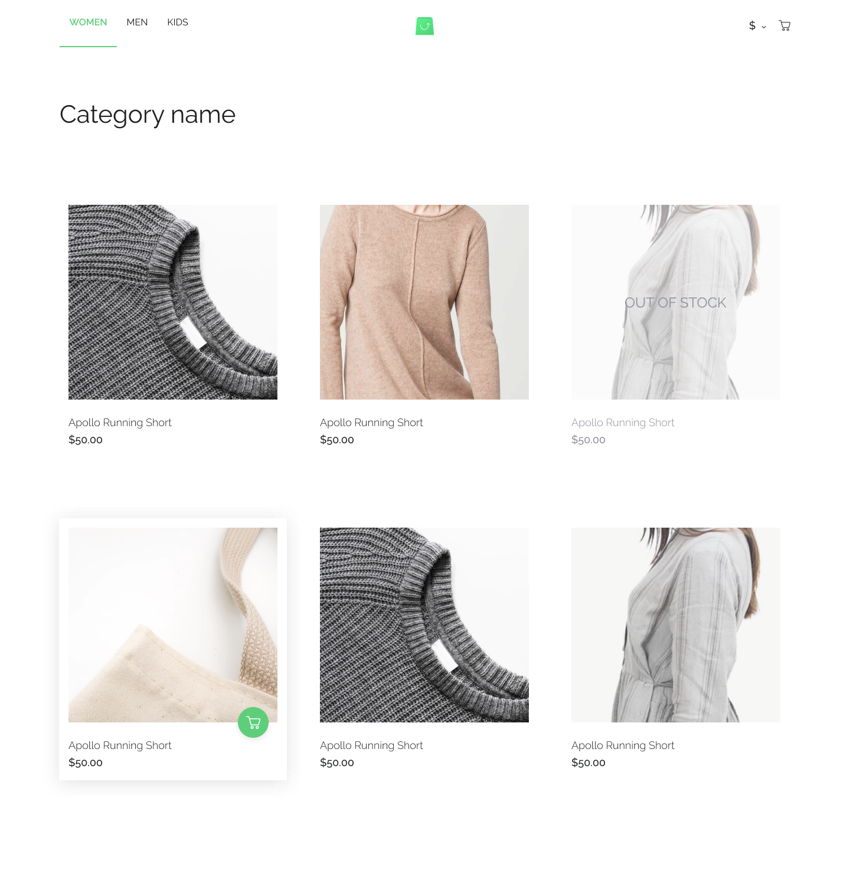

# Entry React developer TEST (SCANDIWEB)

[](https://github.com/LisaProgect/scandi-app-test/actions/workflows/node.js.yml)
[](https://codeclimate.com/github/LisaProgect/scandi-app-test/maintainability)



## Build/Run

[Endpoint data for this project](https://github.com/scandiweb/junior-react-endpoint)

#### Requirements

- Node.js
- NPM

```javascript
/* First, Install the needed packages */
npm install

/* Then start the React app */
npm run start
```
